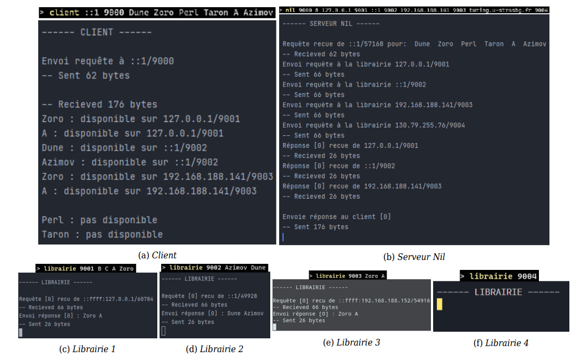

# NIL Server
A TCP/UDP server that allows clients to search and order books from various libraries.

---
## Resources 
- Problem statement available at `enoncé.pdf`.
- Report available at `Rapport.pdf`.

---
## Screenshots 

---

## Instructions

In the `src` folder, compile and run (in the order below):
1. `librairie.c` (launch as many libraries as you need)
2. `nil.c`
3. `client.c`

Additional instructions are avaialble in `Rapport.pdf`.

Enjoy !
